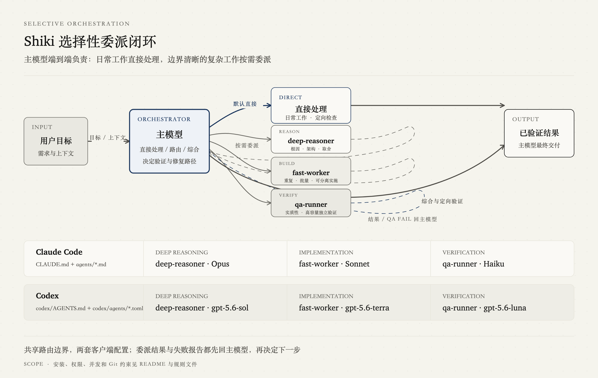

# Shiki

面向 **Claude Code** 与 **Codex** 的多模型 agent 编排配置模板。

它不是一个可运行的应用或 agent 框架，而是一组可复用的指令文件和角色配置：主模型端到端负责，默认直接处理日常工作，只在委派能实质改善质量、速度或上下文隔离时调用专职 agent。

## 工作方式

| 角色 | 职责 | Claude Code 模板 | Codex 模板 |
| --- | --- | --- | --- |
| 主模型 | 直接处理、澄清目标、选择路由、综合结论与决定修复路径 | 当前会话模型 | 当前会话模型 |
| `deep-reasoner` | 实质性根因分析、架构设计、复杂取舍 | Opus | `gpt-5.6-sol` |
| `fast-worker` | 重复、批量或可清晰分离的实施工作 | Sonnet | `gpt-5.6-terra` |
| `qa-runner` | 实质性或高容量独立验证、结果报告 | Haiku | `gpt-5.6-luna` |

典型流程：



图中展示主模型直接交付与按需委派两条路径、验证回流，以及 Claude Code 与 Codex 的模型映射。

模板中的编排规则采用选择性路由：答疑、解释、审查、诊断、少量只读检查和低风险定向修改由主模型直接处理；复杂且边界清晰的工作才按需委派。完整规则请查看 [Claude Code 指令](./CLAUDE.md) 与 [Codex 指令](./codex/AGENTS.md)。

## 快速配置

先克隆仓库并进入根目录。以下示例将 agent 安装为用户级配置，指令文件则放入需要使用编排规则的项目中。

### Claude Code

安装三个 agent：

```bash
mkdir -p ~/.claude/agents
cp -i agents/deep-reasoner.md ~/.claude/agents/deep-reasoner.md
cp -i agents/fast-worker.md ~/.claude/agents/fast-worker.md
cp -i agents/qa-runner.md ~/.claude/agents/qa-runner.md
```

`cp -i` 会在覆盖同名文件前询问。如果目标文件已存在，请拒绝覆盖，比较现有定义与模板后再手动合并。

然后将 [`CLAUDE.md`](./CLAUDE.md) 的规则加入目标项目：

- 目标项目**没有** `CLAUDE.md`：可复制模板。

  ```bash
  cp CLAUDE.md /path/to/your-project/CLAUDE.md
  ```

- 目标项目**已有** `CLAUDE.md`：手动合并 `Orchestration` 等所需章节，**不要直接覆盖**原有的构建命令、Git 约定和项目规则。

如需只在单个项目中使用 agent，也可以将定义放到目标项目的 `.claude/agents/` 目录。

### Codex

安装三个 custom agent：

```bash
mkdir -p ~/.codex/agents
cp -i codex/agents/deep-reasoner.toml ~/.codex/agents/deep-reasoner.toml
cp -i codex/agents/fast-worker.toml ~/.codex/agents/fast-worker.toml
cp -i codex/agents/qa-runner.toml ~/.codex/agents/qa-runner.toml
```

`cp -i` 会在覆盖同名文件前询问。如果目标文件已存在，请拒绝覆盖，比较现有定义与模板后再手动合并。

然后将 [`codex/AGENTS.md`](./codex/AGENTS.md) 的规则加入目标项目：

- 目标项目**没有** `AGENTS.md`：可复制模板。

  ```bash
  cp codex/AGENTS.md /path/to/your-project/AGENTS.md
  ```

- 目标项目**已有** `AGENTS.md`：手动合并编排章节，**不要直接覆盖**现有规则。

如需项目级 custom agent，可将 TOML 定义放到目标项目的 `.codex/agents/` 目录。Codex 的配置字段和可用模型可能随版本变化，请根据本地版本调整模板。

## 验证配置

不要只确认文件已复制，还要确认直接处理与按需委派都符合预期。

1. 检查三个 agent 文件是否位于预期的用户级或项目级目录，且名称与指令文件中的路由名称一致。
2. 提出普通答疑、少量文件检查和低风险定向修改，确认主模型不会仅因 agent 可用而委派。
3. 显式要求主模型调用 `deep-reasoner` 完成一个边界清晰的方案任务，通过当前客户端提供的 agent 状态或日志确认委派管道可用；在 Codex CLI 中可使用 `/agent` 查看线程。
4. 新建一个不含委派先例的会话，提出实质性根因分析、批量实施或高容量独立验证任务，确认主模型只在委派确有收益时主动分派。
5. 核对实际 agent 使用的模型是否与定义文件一致；如果路由异常，优先检查指令文件是否被加载、agent description 是否过宽、路径是否正确，以及本地版本是否支持对应配置。

验证时应同时关注“何时不委派、何时委派、派给谁、使用什么模型”，不要仅凭总 token 或费用推断结果。

## 仓库结构

```text
.
├── README.md                    # Claude Code 与 Codex 的统一入口
├── CLAUDE.md                    # Claude Code 编排与工程规则模板
├── agents/                      # Claude Code agent 定义
│   ├── deep-reasoner.md
│   ├── fast-worker.md
│   └── qa-runner.md
├── CODEX.md                     # Codex 侧扩展说明
└── codex/
    ├── AGENTS.md                # Codex 编排与工程规则模板
    └── agents/                  # Codex custom agent 定义
        ├── deep-reasoner.toml
        ├── fast-worker.toml
        └── qa-runner.toml
```

## 使用注意

- **先合并规则，再按项目调整。** 模板中的 Git、计划文档和验证要求不一定适合所有仓库。
- **模型映射不是硬性依赖。** 表中名称反映当前仓库配置；本地不可用时，应选择同类能力模型并同步修改定义。
- **验证 agent 只报告，不修复。** 失败回到主模型，由主模型根据问题范围决定直接修复或重新委派。
- **只并行独立工作。** 有依赖的阶段保持顺序执行；多个 agent 同时编辑相同文件容易产生冲突。
- **委派不等于节省成本。** 主要收益是职责隔离、验证闭环和保持主会话上下文清晰。

## 参考

- [Claude Code 编排规则](./CLAUDE.md)
- [Claude Code agent 定义](./agents/)
- [Codex 扩展说明](./CODEX.md)
- [Codex 编排规则](./codex/AGENTS.md)
- [Codex custom agent 定义](./codex/agents/)
